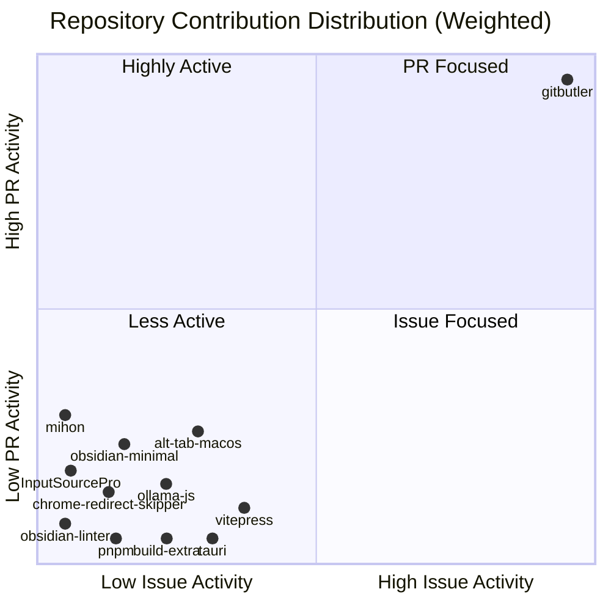

# Contributions

## Overview

### 🏆 Top Contributing Repositories

| Rank | Repository | Authored | Participated | Total |
|:----:|------------|----------:|-------------:|------:|
| **1** | [gitbutlerapp/gitbutler](https://github.com/gitbutlerapp/gitbutler) | 35 | 10 | **45** |
| **2** | [lwouis/alt-tab-macos](https://github.com/lwouis/alt-tab-macos) | 1 | 3 | **4** |
| **3** | [platers/obsidian-linter](https://github.com/platers/obsidian-linter) | 2 | 0 | **2** |
| **4** | [ollama/ollama-js](https://github.com/ollama/ollama-js) | 1 | 1 | **2** |
| **5** | [kepano/obsidian-minimal](https://github.com/kepano/obsidian-minimal) | 1 | 1 | **2** |
| **6** | [tauri-apps/tauri](https://github.com/tauri-apps/tauri) | 1 | 0 | **1** |
| **7** | [vuejs/vitepress](https://github.com/vuejs/vitepress) | 1 | 0 | **1** |
| **8** | [pnpm/pnpm](https://github.com/pnpm/pnpm) | 1 | 0 | **1** |
| **9** | [dogodo-cc/chrome-redirect-skipper](https://github.com/dogodo-cc/chrome-redirect-skipper) | 1 | 0 | **1** |
| **10** | [runjuu/InputSourcePro](https://github.com/runjuu/InputSourcePro) | 1 | 0 | **1** |

### 📊 Summary Statistics

| Category | Metric | Count | Percentage |
|----------|--------|------:|----------:|
| **📈 Overview** | **Total Contributions** | **62** | **100%** |
| | Active Repositories | 12 | - |
| | Core Projects (Member/Collab) | 0 | - |
| **✍️ Authored** | **Issues Created** | **11** | **17.7%** |
| | 🟢 Open Issues | 7 | 11.3% |
| | ⚫ Closed Issues | 4 | 6.5% |
| | **Pull Requests Created** | **36** | **58.1%** |
| | 🟣 Merged PRs | 28 | 45.2% |
| | 🟢 Open PRs | 2 | 3.2% |
| | 🔴 Closed PRs | 6 | 9.7% |
| **🤝 Participated** | **Comments & Discussions** | **14** | **22.6%** |
| | **Code Reviews** | **1** | **1.6%** |
| | **Assigned Issues** | **0** | **0.0%** |

Last updated: 2026-01-09 00:06:35 UTC
