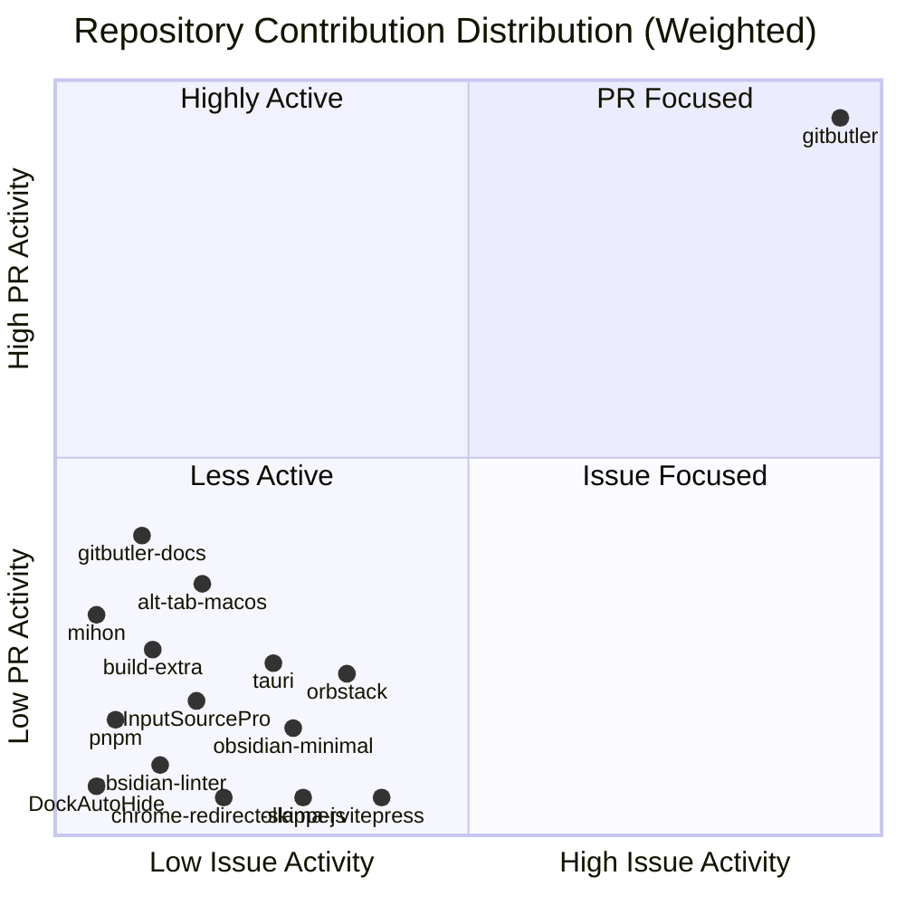

###### Recent Contributions

- 🟣 **[nshcr/DockAutoHide](https://github.com/nshcr/DockAutoHide)** · [#2](https://github.com/nshcr/DockAutoHide/pull/2) refactor: improve dock frame fallback logic · *today*
- 🟣 **[nshcr/DockAutoHide](https://github.com/nshcr/DockAutoHide)** · [#1](https://github.com/nshcr/DockAutoHide/pull/1) feat: restore manual dock auto-hide on app quit · *today*
- 🟣 **[gitbutlerapp/gitbutler](https://github.com/gitbutlerapp/gitbutler)** · [#12818](https://github.com/gitbutlerapp/gitbutler/pull/12818) tauri: scope menu shortcuts to focused window · 💬 1 · *1 week ago*
- 📋 **[gitbutlerapp/gitbutler](https://github.com/gitbutlerapp/gitbutler)** · [#12816](https://github.com/gitbutlerapp/gitbutler/issues/12816) Suggestion: Reduce the minimum window size constraint · 💬 1 · *1 week ago*
- 🔀 **[gitbutlerapp/gitbutler](https://github.com/gitbutlerapp/gitbutler)** · [#12488](https://github.com/gitbutlerapp/gitbutler/pull/12488) feat(ui): use backend normalize method to validate user-entered branch names · 💬 6 · *1 month ago*
- ✅ **[gitbutlerapp/gitbutler](https://github.com/gitbutlerapp/gitbutler)** · [#12267](https://github.com/gitbutlerapp/gitbutler/issues/12267) Abnormal behavior of the "Add empty commit" feature · 💬 7 · *1 month ago*
- 🟣 **[gitbutlerapp/gitbutler](https://github.com/gitbutlerapp/gitbutler)** · [#12212](https://github.com/gitbutlerapp/gitbutler/pull/12212) fix: use a unified file list sorting rule in both list and tree views · 💬 7 · *1 month ago*
- 🟣 **[gitbutlerapp/gitbutler](https://github.com/gitbutlerapp/gitbutler)** · [#12189](https://github.com/gitbutlerapp/gitbutler/pull/12189) fix(skill): Update GitHub Copilot skill path to correct location · 💬 6 · *1 month ago*
- 🟣 **[gitbutlerapp/gitbutler](https://github.com/gitbutlerapp/gitbutler)** · [#11753](https://github.com/gitbutlerapp/gitbutler/pull/11753) feat: add all changed files panel for applied branch view · 💬 3 · *2 months ago*
- 🟣 **[gitbutlerapp/gitbutler](https://github.com/gitbutlerapp/gitbutler)** · [#11752](https://github.com/gitbutlerapp/gitbutler/pull/11752) fix: subscribe persisted store to prevent reused instances from sharing state for FileListMode · 💬 2 · *2 months ago*

###### Overview

Top Contributing Repositories

| Rank | Repository | Authored | Participated | Total |
|:----:|------------|----------:|-------------:|------:|
| **1** | [gitbutlerapp/gitbutler](https://github.com/gitbutlerapp/gitbutler) | 43 | 15 | **58** |
| **2** | [lwouis/alt-tab-macos](https://github.com/lwouis/alt-tab-macos) | 1 | 3 | **4** |
| **3** | [nshcr/DockAutoHide](https://github.com/nshcr/DockAutoHide) | 2 | 0 | **2** |
| **4** | [platers/obsidian-linter](https://github.com/platers/obsidian-linter) | 2 | 0 | **2** |
| **5** | [ollama/ollama-js](https://github.com/ollama/ollama-js) | 1 | 1 | **2** |
| **6** | [kepano/obsidian-minimal](https://github.com/kepano/obsidian-minimal) | 1 | 1 | **2** |
| **7** | [tauri-apps/tauri](https://github.com/tauri-apps/tauri) | 1 | 0 | **1** |
| **8** | [vuejs/vitepress](https://github.com/vuejs/vitepress) | 1 | 0 | **1** |
| **9** | [pnpm/pnpm](https://github.com/pnpm/pnpm) | 1 | 0 | **1** |
| **10** | [dogodo-cc/chrome-redirect-skipper](https://github.com/dogodo-cc/chrome-redirect-skipper) | 1 | 0 | **1** |

Summary Statistics

| Category | Metric | Count | Percentage |
|----------|--------|------:|----------:|
| **Overview** | **Total Contributions** | **79** | **100%** |
| | Active Repositories | 15 | - |
| | Core Projects (Member/Collab) | 1 | - |
| **Authored** | **Issues Created** | **13** | **16.5%** |
| | 🟢 Open Issues | 8 | 10.1% |
| | ⚫ Closed Issues | 5 | 6.3% |
| | **Pull Requests Created** | **44** | **55.7%** |
| | 🟣 Merged PRs | 35 | 44.3% |
| | 🟢 Open PRs | 1 | 1.3% |
| | 🔴 Closed PRs | 8 | 10.1% |
| **Participated** | **Comments & Discussions** | **21** | **26.6%** |
| | **Code Reviews** | **1** | **1.3%** |
| | **Assigned Issues** | **0** | **0.0%** |

Last updated: 2026-03-23 00:07:24 UTC
