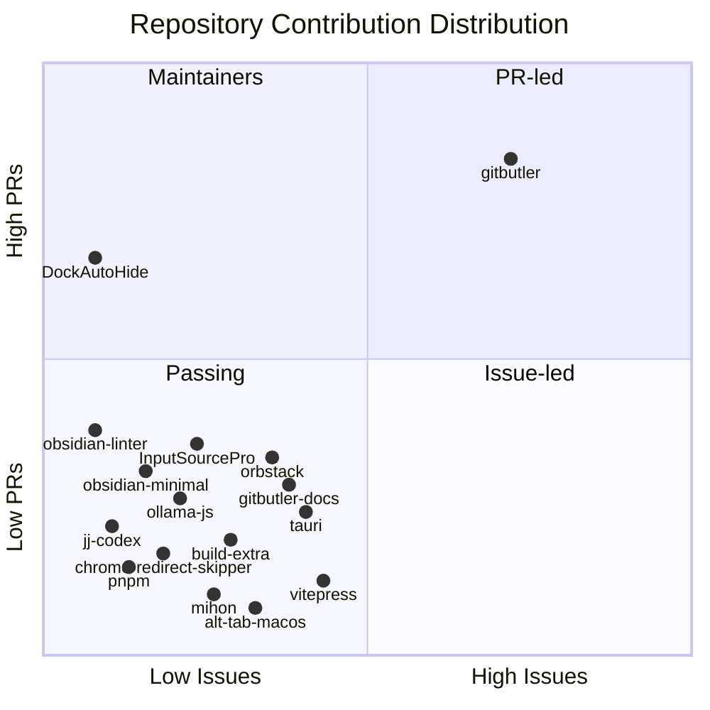

###### Recent Contributions

- 🟣 **[nshcr/jj-codex](https://github.com/nshcr/jj-codex)** · [#1](https://github.com/nshcr/jj-codex/pull/1) docs: improve GitHub project page · *2 weeks ago*
- 🟣 **[nshcr/DockAutoHide](https://github.com/nshcr/DockAutoHide)** · [#10](https://github.com/nshcr/DockAutoHide/pull/10) ci: enhance release workflow with validation and notarization · *4 months ago*
- 🟣 **[nshcr/DockAutoHide](https://github.com/nshcr/DockAutoHide)** · [#9](https://github.com/nshcr/DockAutoHide/pull/9) build: upgrade Xcode build version to 2640 · *4 months ago*
- 🟣 **[nshcr/DockAutoHide](https://github.com/nshcr/DockAutoHide)** · [#8](https://github.com/nshcr/DockAutoHide/pull/8) build: update app icon to DockAutoHide · *4 months ago*
- 🟣 **[nshcr/DockAutoHide](https://github.com/nshcr/DockAutoHide)** · [#7](https://github.com/nshcr/DockAutoHide/pull/7) build: disable app sandbox and enable apple events in entitlements · *4 months ago*
- 🟣 **[nshcr/DockAutoHide](https://github.com/nshcr/DockAutoHide)** · [#6](https://github.com/nshcr/DockAutoHide/pull/6) build: remove test targets from scheme · *4 months ago*
- 🟣 **[nshcr/DockAutoHide](https://github.com/nshcr/DockAutoHide)** · [#5](https://github.com/nshcr/DockAutoHide/pull/5) fix: base smart switching on actual dock geometry · *4 months ago*
- 🟣 **[nshcr/DockAutoHide](https://github.com/nshcr/DockAutoHide)** · [#4](https://github.com/nshcr/DockAutoHide/pull/4) ci: add immutable release validation and asset verification · *4 months ago*
- 🟣 **[nshcr/DockAutoHide](https://github.com/nshcr/DockAutoHide)** · [#3](https://github.com/nshcr/DockAutoHide/pull/3) ci: restrict release uploads and add homebrew tap automation · *4 months ago*
- 🟣 **[nshcr/DockAutoHide](https://github.com/nshcr/DockAutoHide)** · [#2](https://github.com/nshcr/DockAutoHide/pull/2) refactor: improve dock frame fallback logic · *4 months ago*

###### Overview

Top Contributing Repositories

| Rank | Repository | Authored | Participated | Total |
|:----:|------------|----------:|-------------:|------:|
| **1** | [gitbutlerapp/gitbutler](https://github.com/gitbutlerapp/gitbutler) | 43 | 15 | **58** |
| **2** | [nshcr/DockAutoHide](https://github.com/nshcr/DockAutoHide) | 10 | 0 | **10** |
| **3** | [lwouis/alt-tab-macos](https://github.com/lwouis/alt-tab-macos) | 1 | 3 | **4** |
| **4** | [platers/obsidian-linter](https://github.com/platers/obsidian-linter) | 2 | 0 | **2** |
| **5** | [ollama/ollama-js](https://github.com/ollama/ollama-js) | 1 | 1 | **2** |
| **6** | [kepano/obsidian-minimal](https://github.com/kepano/obsidian-minimal) | 1 | 1 | **2** |
| **7** | [tauri-apps/tauri](https://github.com/tauri-apps/tauri) | 1 | 0 | **1** |
| **8** | [vuejs/vitepress](https://github.com/vuejs/vitepress) | 1 | 0 | **1** |
| **9** | [nshcr/jj-codex](https://github.com/nshcr/jj-codex) | 1 | 0 | **1** |
| **10** | [pnpm/pnpm](https://github.com/pnpm/pnpm) | 1 | 0 | **1** |

Summary Statistics

| Category | Metric | Count | Percentage |
|----------|--------|------:|----------:|
| **Overview** | **Total Contributions** | **88** | **100%** |
| | Active Repositories | 16 | - |
| | Core Projects (Member/Collab) | 2 | - |
| **Authored** | **Issues Created** | **13** | **14.8%** |
| | 🟢 Open Issues | 6 | 6.8% |
| | ⚫ Closed Issues | 7 | 8.0% |
| | **Pull Requests Created** | **53** | **60.2%** |
| | 🟣 Merged PRs | 44 | 50.0% |
| | 🟢 Open PRs | 0 | 0.0% |
| | 🔴 Closed PRs | 9 | 10.2% |
| **Participated** | **Comments & Discussions** | **21** | **23.9%** |
| | **Code Reviews** | **1** | **1.1%** |
| | **Assigned Issues** | **0** | **0.0%** |

Last updated: 2026-07-29 00:17:33 UTC
