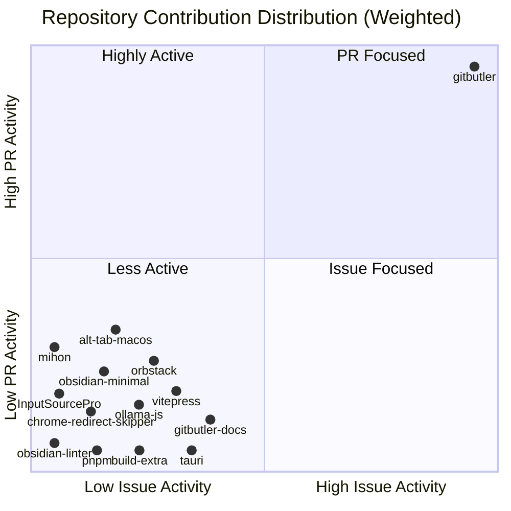

###### Recent Contributions

- 🔀 **[gitbutlerapp/gitbutler](https://github.com/gitbutlerapp/gitbutler)** · [#12488](https://github.com/gitbutlerapp/gitbutler/pull/12488) feat(ui): use backend normalize method to validate user-entered branch names · 💬 6 · *1 week ago*
- 📋 **[gitbutlerapp/gitbutler](https://github.com/gitbutlerapp/gitbutler)** · [#12267](https://github.com/gitbutlerapp/gitbutler/issues/12267) Abnormal behavior of the "Add empty commit" feature · 💬 6 · *3 weeks ago*
- 🟣 **[gitbutlerapp/gitbutler](https://github.com/gitbutlerapp/gitbutler)** · [#12212](https://github.com/gitbutlerapp/gitbutler/pull/12212) fix: use a unified file list sorting rule in both list and tree views · 💬 7 · *3 weeks ago*
- 🟣 **[gitbutlerapp/gitbutler](https://github.com/gitbutlerapp/gitbutler)** · [#12189](https://github.com/gitbutlerapp/gitbutler/pull/12189) fix(skill): Update GitHub Copilot skill path to correct location · 💬 6 · *3 weeks ago*
- 🟣 **[gitbutlerapp/gitbutler](https://github.com/gitbutlerapp/gitbutler)** · [#11753](https://github.com/gitbutlerapp/gitbutler/pull/11753) feat: add all changed files panel for applied branch view · 💬 3 · *1 month ago*
- 🟣 **[gitbutlerapp/gitbutler](https://github.com/gitbutlerapp/gitbutler)** · [#11752](https://github.com/gitbutlerapp/gitbutler/pull/11752) fix: subscribe persisted store to prevent reused instances from sharing state for FileListMode · 💬 2 · *1 month ago*
- 📋 **[gitbutlerapp/gitbutler](https://github.com/gitbutlerapp/gitbutler)** · [#11746](https://github.com/gitbutlerapp/gitbutler/issues/11746) Suggestion: simplify list mode state management for the file list view · 💬 5 · *1 month ago*
- 🔴 **[gitbutlerapp/gitbutler](https://github.com/gitbutlerapp/gitbutler)** · [#11745](https://github.com/gitbutlerapp/gitbutler/pull/11745) fix: ensure first changed file is correctly selected for preview when switching between commits · 💬 5 · *1 month ago*
- 🔴 **[gitbutlerapp/gitbutler](https://github.com/gitbutlerapp/gitbutler)** · [#11723](https://github.com/gitbutlerapp/gitbutler/pull/11723) feat: software localization (i18n support) 📝 | ❤️ 1 · 💬 6 · *1 month ago*
- 📋 **[tauri-apps/tauri](https://github.com/tauri-apps/tauri)** · [#14735](https://github.com/tauri-apps/tauri/issues/14735) [feat] bundler: Enable multithreaded compression when building RPMs with the zstd · *1 month ago*

###### Overview

Top Contributing Repositories

| Rank | Repository | Authored | Participated | Total |
|:----:|------------|----------:|-------------:|------:|
| **1** | [gitbutlerapp/gitbutler](https://github.com/gitbutlerapp/gitbutler) | 41 | 14 | **55** |
| **2** | [lwouis/alt-tab-macos](https://github.com/lwouis/alt-tab-macos) | 1 | 3 | **4** |
| **3** | [platers/obsidian-linter](https://github.com/platers/obsidian-linter) | 2 | 0 | **2** |
| **4** | [ollama/ollama-js](https://github.com/ollama/ollama-js) | 1 | 1 | **2** |
| **5** | [kepano/obsidian-minimal](https://github.com/kepano/obsidian-minimal) | 1 | 1 | **2** |
| **6** | [tauri-apps/tauri](https://github.com/tauri-apps/tauri) | 1 | 0 | **1** |
| **7** | [vuejs/vitepress](https://github.com/vuejs/vitepress) | 1 | 0 | **1** |
| **8** | [pnpm/pnpm](https://github.com/pnpm/pnpm) | 1 | 0 | **1** |
| **9** | [dogodo-cc/chrome-redirect-skipper](https://github.com/dogodo-cc/chrome-redirect-skipper) | 1 | 0 | **1** |
| **10** | [runjuu/InputSourcePro](https://github.com/runjuu/InputSourcePro) | 1 | 0 | **1** |

Summary Statistics

| Category | Metric | Count | Percentage |
|----------|--------|------:|----------:|
| **Overview** | **Total Contributions** | **74** | **100%** |
| | Active Repositories | 14 | - |
| | Core Projects (Member/Collab) | 0 | - |
| **Authored** | **Issues Created** | **12** | **16.2%** |
| | 🟢 Open Issues | 8 | 10.8% |
| | ⚫ Closed Issues | 4 | 5.4% |
| | **Pull Requests Created** | **41** | **55.4%** |
| | 🟣 Merged PRs | 32 | 43.2% |
| | 🟢 Open PRs | 1 | 1.4% |
| | 🔴 Closed PRs | 8 | 10.8% |
| **Participated** | **Comments & Discussions** | **20** | **27.0%** |
| | **Code Reviews** | **1** | **1.4%** |
| | **Assigned Issues** | **0** | **0.0%** |

Last updated: 2026-03-02 00:04:57 UTC
